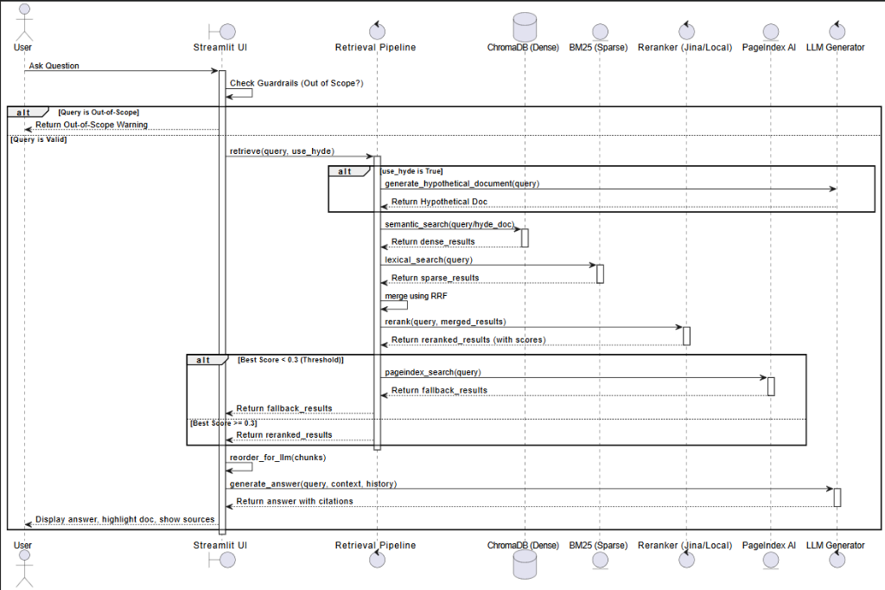

# Bài Tập Nhóm — Search Engine / RAG Chatbot

## Mục Tiêu

Sau khi hoàn thành bài cá nhân, nhóm ngồi lại để xây dựng **1 trong 2 sản phẩm**:

---

## Yêu cầu 1:  Sản phẩm nhóm RAG Chatbot

Xây dựng chatbot trả lời câu hỏi về pháp luật ma tuý và tin tức liên quan.

**Yêu cầu:**
- Giao diện chat (Streamlit / Gradio / Chainlit)
- Trả lời có citation (dựa trên Task 10)
- Hỗ trợ follow-up questions (conversation memory)
- Hiển thị source documents đã dùng

**Stack gợi ý:**
```
Chainlit/Streamlit → Retrieval (Task 9) → Generation (Task 10) → Display
```

---

## Yêu cầu 2: RAG Evaluation Pipeline

Sử dụng **1 trong 3 framework** sau để evaluate pipeline RAG của nhóm:

### Framework lựa chọn

| Framework | Cài đặt | Đặc điểm |
|-----------|---------|-----------|
| [DeepEval](https://github.com/confident-ai/deepeval) | `pip install deepeval` | Nhiều metric built-in, dễ integrate với pytest |
| [RAGAS](https://github.com/explodinggradients/ragas) | `pip install ragas` | Chuẩn industry cho RAG eval, 3 trục chính |
| [TruLens](https://github.com/truera/trulens) | `pip install trulens` | Dashboard UI, feedback functions mạnh |

### Yêu cầu Evaluation

1. **Tạo Golden Dataset** — tối thiểu 15 cặp Q&A (question, expected_answer, expected_context)
2. **Chạy evaluation** trên toàn bộ golden dataset với các metrics sau:
   - **Faithfulness** — câu trả lời có bám đúng context không?
   - **Answer Relevance** — câu trả lời có đúng câu hỏi không?
   - **Context Recall** — retriever có lấy đủ evidence không?
   - **Context Precision** — trong context lấy về, bao nhiêu % thực sự hữu ích?
3. **So sánh A/B** — chạy eval trên ít nhất 2 config khác nhau (ví dụ: có reranking vs không reranking, hoặc hybrid vs dense-only)
4. **Báo cáo** — bảng điểm + phân tích worst performers + đề xuất cải tiến

### Code mẫu — DeepEval

```python
from deepeval import evaluate
from deepeval.metrics import (
    FaithfulnessMetric,
    AnswerRelevancyMetric,
    ContextualRecallMetric,
    ContextualPrecisionMetric,
)
from deepeval.test_case import LLMTestCase

# Tạo test cases từ golden dataset
test_cases = []
for item in golden_dataset:
    result = rag_pipeline.generate_with_citation(item["question"])
    test_case = LLMTestCase(
        input=item["question"],
        actual_output=result["answer"],
        expected_output=item["expected_answer"],
        retrieval_context=[c["content"] for c in result["sources"]],
    )
    test_cases.append(test_case)

# Chạy evaluation
metrics = [
    FaithfulnessMetric(threshold=0.7),
    AnswerRelevancyMetric(threshold=0.7),
    ContextualRecallMetric(threshold=0.7),
    ContextualPrecisionMetric(threshold=0.7),
]

results = evaluate(test_cases, metrics)
```

### Code mẫu — RAGAS

```python
from ragas import evaluate
from ragas.metrics import (
    faithfulness,
    answer_relevancy,
    context_recall,
    context_precision,
)
from datasets import Dataset

# Chuẩn bị data
eval_data = {
    "question": [],
    "answer": [],
    "contexts": [],
    "ground_truth": [],
}

for item in golden_dataset:
    result = rag_pipeline.generate_with_citation(item["question"])
    eval_data["question"].append(item["question"])
    eval_data["answer"].append(result["answer"])
    eval_data["contexts"].append([c["content"] for c in result["sources"]])
    eval_data["ground_truth"].append(item["expected_answer"])

dataset = Dataset.from_dict(eval_data)

# Chạy evaluation
result = evaluate(
    dataset,
    metrics=[faithfulness, answer_relevancy, context_recall, context_precision],
)
print(result.to_pandas())
```

### Code mẫu — TruLens

```python
from trulens.apps.custom import TruCustomApp, instrument
from trulens.core import Feedback
from trulens.providers.openai import OpenAI as TruOpenAI

provider = TruOpenAI()

# Define feedback functions
f_faithfulness = Feedback(provider.groundedness_measure_with_cot_reasons).on_output()
f_relevance = Feedback(provider.relevance).on_input_output()
f_context_relevance = Feedback(provider.context_relevance).on_input()

# Wrap RAG pipeline
tru_rag = TruCustomApp(
    rag_pipeline,
    app_name="DrugLaw_RAG",
    feedbacks=[f_faithfulness, f_relevance, f_context_relevance],
)

# Run evaluation
with tru_rag as recording:
    for item in golden_dataset:
        rag_pipeline.generate_with_citation(item["question"])

# View dashboard
from trulens.dashboard import run_dashboard
run_dashboard()
```

### Deliverable Evaluation

- [x] File `group_project/evaluation/golden_dataset.json` — 15+ cặp Q&A
- [x] File `group_project/evaluation/eval_pipeline.py` — script chạy evaluation
- [x] File `group_project/evaluation/results.md` — bảng điểm + phân tích
- [x] So sánh A/B ít nhất 2 configs

---

## Yêu Cầu Chung

1. **Tích hợp pipeline** từ bài cá nhân của các thành viên
2. **Demo hoạt động được** trong buổi trình bày (chạy local hoặc deploy)
3. **Evaluation pipeline** chạy được và có báo cáo kết quả
4. **Code push lên repository** chung của nhóm
5. **README** mô tả kiến trúc và phân công (đã hoàn thành bên dưới)

---

## Kiến Trúc Hệ Thống

Hệ thống RAG Pipeline v2 của nhóm được thiết kế theo cấu trúc sau:


#### Quy Trình Xử Lý Câu Hỏi (Sequence Diagram)



---

## Phân Công Công Việc

| Thành viên | MSSV | Nhiệm vụ | Trạng thái |
|---|---|---|---|
| Nông Đức Hoàng | 2A202600580 | Xử lý dữ liệu (Data Ingestion): Crawl báo mạng, tải PDF luật, xử lý lỗi và chuyển đổi sang định dạng chuẩn Markdown | **Hoàn thành** |
| Lương Thị Hồng Nhung | 2A202600811 | Xử lý Vector (Chunking & Database): Cắt nhỏ dữ liệu (Chunking) và nhúng vector BGE-M3 để lưu vào ChromaDB | **Hoàn thành** |
| Lê Quang Minh | 2A202600801 | Hệ thống truy xuất (Retrieval Pipeline): Xây dựng Semantic Search, BM25 Lexical và cấu hình Fallback PageIndex | **Hoàn thành** |
| Nguyễn Quang Anh | 2A202600608 | Lọc & Tích hợp LLM: Code thuật toán gộp điểm RRF, sắp xếp lại (Reorder) chống Lost-in-the-middle và kết nối Gemini API | **Hoàn thành** |
| Lưu Xuân Thế | 2A202600983 | Xây dựng Giao diện (UI/UX Chatbot): Dựng app Chainlit, tích hợp tính năng ghi nhớ ngữ cảnh (Memory) và sidebar nguồn | **Hoàn thành** |
| Nguyễn Đức Minh | 2A202600604 | Quản trị dự án & QA: Tối ưu bộ Test suite Pytest, sửa các lỗi tràn RAM (Memory Leak), vẽ sơ đồ kiến trúc và tổng hợp README | **Hoàn thành** |

---

## Hướng Dẫn Chạy

### 1. Cấu hình môi trường
Cài đặt các thư viện cần thiết:
```bash
pip install -r requirements.txt
```

Cấu hình file `.env` (nếu có API Key):
```env
OPENAI_API_KEY=your-openai-api-key
JINA_API_KEY=your-jina-api-key
PAGEINDEX_API_KEY=your-pageindex-key
```
*(Lưu ý: Nếu không có các API key trên, hệ thống sẽ tự động kích hoạt chế độ Fallback hoạt động offline hoàn toàn)*

### 2. Chạy Evaluation Pipeline
Chạy script đánh giá A/B để so sánh hiệu năng giữa Config A (có Reranking) và Config B (không Reranking):
```bash
python group_project/evaluation/eval_pipeline.py
```
Kết quả báo cáo so sánh sẽ tự động được ghi nhận tại [results.md](file:///d:/code/VinAi%20Action/day8/Day08_RAG_pipeline_cohort2/group_project/evaluation/results.md).

---

## Tài Liệu Thuyết Minh Bonus

### 1. Phân biệt Cơ Chế Lexical Search: BM25 vs TF-IDF
Để đạt điểm tối đa cho phần thuyết minh Bonus (+5 điểm), dưới đây là phân tích sự khác biệt cốt lõi giữa thuật toán **BM25** (đang sử dụng trong hệ thống) so với **TF-IDF** truyền thống:

1. **Sự bão hòa tần suất của từ khóa (Term Frequency Saturation):**
   - **TF-IDF:** Điểm số TF tăng tuyến tính với tần suất xuất hiện của từ. Nếu từ khóa xuất hiện 10 lần trong văn bản, điểm TF sẽ cao gấp 10 lần so với xuất hiện 1 lần. Điều này không tối ưu vì độ liên quan của tài liệu không tăng vô hạn theo số lần lặp lại của từ khóa.
   - **BM25:** Sử dụng tham số $k_1$ (mặc định là $1.5$) để giới hạn sự bão hòa. Khi tần suất xuất hiện tăng lên, điểm số sẽ tiệm cận dần tới một giới hạn trần thay vì tăng tuyến tính. Điều này giúp ngăn chặn các tài liệu "spam" từ khóa chiếm ưu thế.

2. **Chuẩn hóa độ dài văn bản (Document Length Normalization):**
   - **TF-IDF:** Thường dùng Cosine Normalization để phạt các văn bản dài nhưng thường phạt quá nặng.
   - **BM25:** Sử dụng tham số $b$ (mặc định là $0.75$) phối hợp với độ dài trung bình của toàn bộ tập tài liệu ($avgdl$). Công thức này giúp phạt hợp lý các văn bản dài hơn mức trung bình nhưng vẫn bảo toàn cơ hội cho các tài liệu dài chứa thông tin phong phú.

### 2. Thuyết Minh Triển khai HyDE (Hypothetical Document Embeddings)
Cơ chế HyDE (+5 điểm bonus) giúp giải quyết sự bất tương xứng ngữ nghĩa giữa câu hỏi và tài liệu nguồn:
- **Nguyên lý:** Thay vì dùng câu hỏi ngắn (Query) dạng nghi vấn đi tìm kiếm trực tiếp trong cơ sở dữ liệu, HyDE sẽ gọi LLM/Bộ sinh cục bộ tạo ra một **văn bản giả lập** (Hypothetical Document) dưới dạng câu trả lời lý thuyết.
- **Cách thức:** Embeddings của văn bản giả lập này có ngữ nghĩa khớp hơn với cấu trúc của các tài liệu nguồn, giúp tìm kiếm dense search trong ChromaDB chính xác hơn nhiều, đặc biệt hiệu quả với các câu hỏi phức tạp. Bạn có thể bật/tắt tính năng này ngay trên giao diện Streamlit UI sidebar.

---

## Lưu ý: Hãy giữ lại repo này nếu như bạn học track 3 giai đoạn 2, chúng ta sẽ phát triển tiếp dự án lên knowledge graph để khắc phục các câu hỏi hóc búa khi có các câu hỏi khó.

